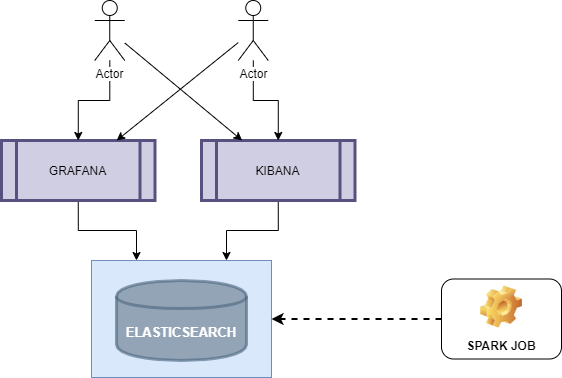

# Pyspark e Elasticsearch Opendistro

> Elasticsearch business analytics.

[![Elasticsearch Version][elastic-image]][elastic-url]
[![Jupyter Version][jupter-image]][jupter-url]
[![Grafana Version][grafana-image]][grafana-url]
[![Opendistro Version][opendistro-image]][opendistro-url]

Esse ambiente foi criado para reproduzir eventos de negócio simulando a venda de um produto de seguro de automóvel.

Apesar de simples esse modelo pode ser extendido e utilizado para criar soluções maiores e de grande visibilidade. Outro ponto importante é a segurança, o ambiente já tem a capacidade de ser integrado com um Active Directory, LDAP, OIDC (Open Authentication 2) ou SAML2.

As versões utilizadas foram o Elasticsearch Open Distro (Ekasticsearch e Kibana), Grafana e jupyter-notebook.
# 

### Como configurar:
```sh
* git clone https://github.com/marcosvasconcelos/pysparkES.git
* cd ~/pysparkES
* chmod 765 build.sh
* ./build.sh
```

Todas as imagens necessárias serão carregadas e uma imagem do jupyter-notebook será compilada para a integração com o elasticsearch

# Mapeamento

| Container     | Porta | Usuario   | Senha     |
|---------------|-------|-----------|-----------|
| pyspark-es    | 8888  |  N/A      | jpt@teste |
| elastic-node1 | 9200  |  admin    | admin     |
| kibana        | 5601  |  admin    | admin     |
| grafana       | 3000  |  admin    | admin     |




## Contatos

Marcos Vinicius Vasconcelos Silva – [@marc_vasc](https://twitter.com/marc_vasc) – marvinred@gmail.com

[https://github.com/marcosvasconcelos](https://github.com/marcosvasconcelos/)

<!-- Markdown link & img dfn's -->
[elastic-image]: https://img.shields.io/badge/elasticsearch-build-blue
[elastic-url]: https://www.elastic.co/elastic-stack
[jupter-image]: https://img.shields.io/badge/jupter-build-orange
[jupter-url]: https://jupyter.org/
[grafana-image]: https://img.shields.io/badge/grafana-build-red
[grafana-url]: https://grafana.com/
[opendistro-image]: https://img.shields.io/badge/opendistro-build-darkblue
[opendistro-url]: https://opendistro.github.io/for-elasticsearch/

[wiki]: https://github.com/marcosvasconcelos/pysparkES/wiki
